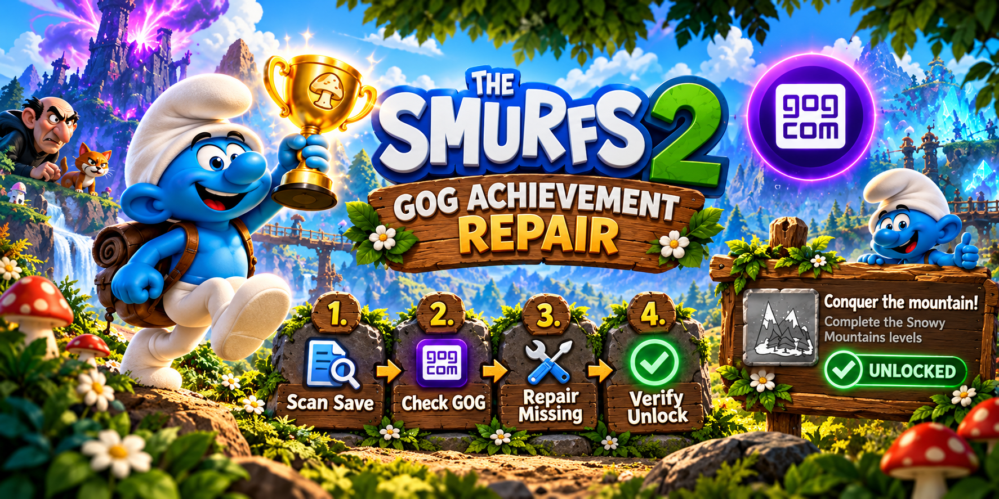

# The Smurfs 2: The Prisoner of the Green Stone - GOG Achievement Repair

Repairs GOG Galaxy achievements that should already be unlocked according to your local `flow.sav` progression.

This tool was created for the GOG release of **The Smurfs 2: The Prisoner of the Green Stone** (product ID `1906012961`). It does **not** modify the game save.

## What it does

The repair tool reads the local Unreal Engine save, compares provable progress with the live GOG achievement state, and offers to repair achievements that are missing even though their conditions are already met.

Statuses:

- `UNLOCKED` - already unlocked on GOG.
- `VERIFIED` - the save proves the requirement is met; automatic repair is available.
- `INFO` - the save does not keep reliable proof for this event-specific achievement; manual repair is available only if you genuinely earned it.
- `NOT MET` - the save proves the known requirement has not been completed.

`Smurfinator` is eligible for automatic repair only after every other GOG achievement is reported as unlocked.

## Safety

- `flow.sav` is opened read-only and is never modified.
- GOG authentication tokens are never printed or written to the log.
- Unknown or missing achievement mappings are not written.
- `NOT MET` achievements are not offered by the manual `INFO` menu.
- A server write is shown as `[OK]` only after the tool re-reads the GOG account and confirms a non-null unlock date.

## Usage

1. Close the game.
2. Keep **GOG Galaxy open and signed in**.
3. Run `Smurfs2_GOG_Achievement_Repair.exe`.
4. Review the audit.
5. Type `REPARER` when prompted to repair `VERIFIED` achievements.
6. Trust only entries reported as `[OK]` after server verification.
7. Refresh the Achievements page in GOG Galaxy. Restart Galaxy if its UI has not refreshed yet.

The normal save location is:

```text
%LOCALAPPDATA%\SM2\Saved\SaveGames\flow.sav
```

Multiple used save slots are evaluated.

## Manual INFO mode

Some one-off achievements do not leave a reliable persistent flag in `flow.sav`. These appear as `INFO` and can be selected manually after the automatic repair pass.

Only use manual repair if you genuinely completed the achievement requirement in-game. **Unlocking an achievement you did not earn is cheating.**

## Offline audit

To analyse a save without contacting GOG:

```text
Smurfs2_GOG_Achievement_Repair.exe --offline-audit "path\to\flow.sav"
```

Offline mode cannot know which achievements are already unlocked on the live GOG account and cannot evaluate the live-account condition for `Smurfinator`.

## Script version

The script/source release contains the same Go source used for the Windows executable. It only uses the Go standard library.

Run directly with Go:

```text
go run Smurfs2_GOG_Achievement_Repair.go
```

Build a Windows x64 executable:

```text
set GOOS=windows
set GOARCH=amd64
go build -trimpath -o Smurfs2_GOG_Achievement_Repair.exe Smurfs2_GOG_Achievement_Repair.go
```

## Tested release

Version **1.0.0** is the cleaned public build of the V3 repair logic that was live-tested successfully against GOG Galaxy.

The V2 write path is intentionally discarded: sending `date_unlocked: null` clears an achievement instead of unlocking it. The current version sends an explicit UTC unlock timestamp and then verifies the result from GOG before reporting success.

## Disclaimer

Use the manual repair option responsibly. This project is an unofficial community tool and is not affiliated with Microids, OSome Studio, Peyo Company, or GOG.
